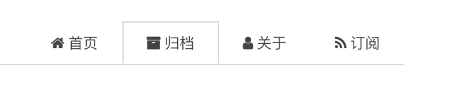

## 安装feed插件

hexo博客有一个专门生成RSS xml文件的插件`hexo-generator-feed`
我们来安装它


```bash
$ npm install hexo-generator-feed
added 3 packages in 30.155s
```

看到added 3 packages说明安装成功了。

## 启用插件

在博客工程文件根目录下`_config.yml`文件中添加如下内容


```bash
# Extensions
plugins:
    hexo-generator-feed
#Feed Atom
feed:
    type: atom
    path: atom.xml
    limit: 20
```

## 生成RSS

```csharp
$ hexo g
(node:6520) [DEP0061] DeprecationWarning: fs.SyncWriteStream is depre                                                                                                                           cated.
INFO  Start processing
INFO  Files loaded in 6.33 s
INFO  Generated: atom.xml <----------成功生成atom.xml文件
INFO  Generated: sitemap.xml
INFO  Generated: baidusitemap.xml
INFO  Generated: about/index.html
......
......
......
```

## 
