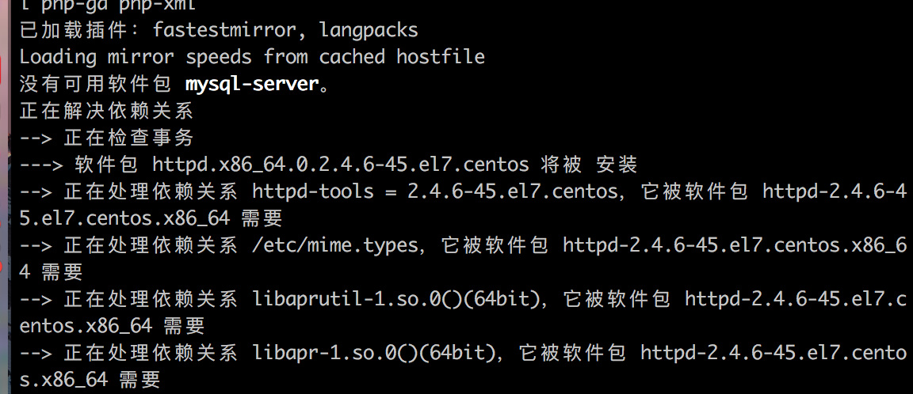
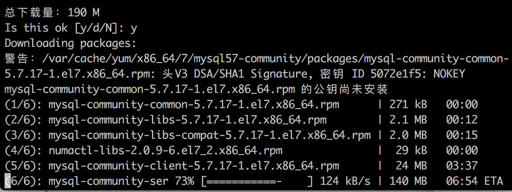
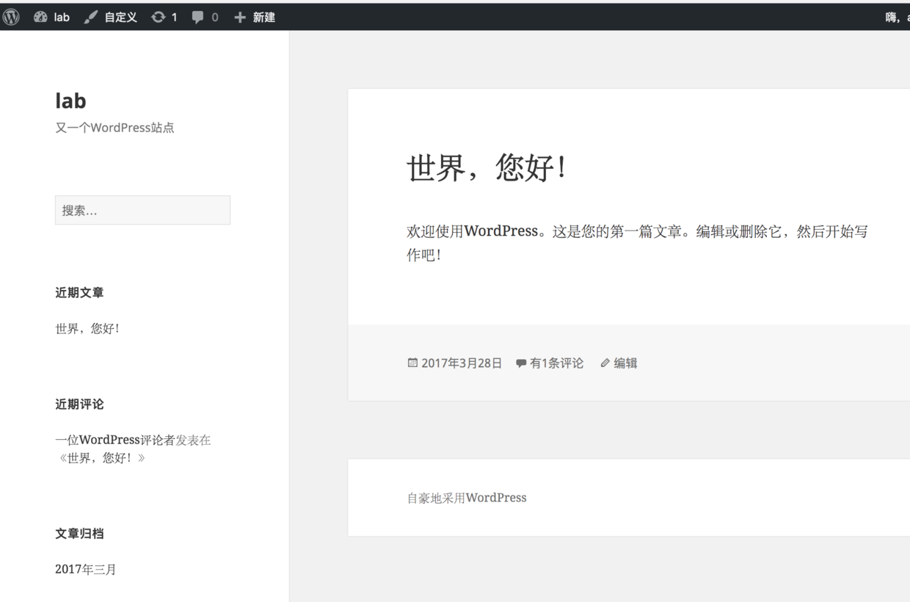

###安装：
相对于自己去配置PHP,MYSQL,及HTTP服务，安装LAMP服务器系统（Linux、Apache、MySQL、PHP ）确实好了太多太多，不过自己去配坑多，也是能够很好的吸收建站知识。
创建LAMP直接下载套件：yum -y install httpd mysql mysql-server php php-mysql php-gd php-xml
yum 是Linux下包管理命令，

这种情况下需要自己去下载mysql:
# 下载mysql源安装包
shell> wget http://dev.mysql.com/get/mysql57-community-release-el7-8.noarch.rpm
# 安装mysql源
shell> yum localinstall mysql57-community-release-el7-8.noarch.rpm
检查mysql源是否安装成功
shell> yum repolist enabled | grep "mysql.*-community.*"

 看到上图所示表示安装成功
2、安装MySQL
shell> yum install mysql-community-server


要安装的东西挺多的

在数据库的操作中学到了几个有用的命令：
```
启动
shell> systemctl start mysqld
查看MySQL的启动状态
shell> systemctl status mysqld
开机启动
shell> systemctl enable mysqld
shell> systemctl daemon-reload
```
在日志里面查看生成的临时密码，可以通过下面命令快速查找
```
shell> grep 'temporary password' /var/log/mysqld.log
//连接数据库
mysql -uroot -p
//重置密码
 ALTER USER 'root'@'localhost' IDENTIFIED BY 'MyNewPass4!'; 
//添加远程账号：这个非常有用
GRANT ALL PRIVILEGES ON *.* TO 'yangxin'@'%' IDENTIFIED BY 'Yangxin0917!' WITH GRANT OPTION;
```

参考：[[[MySQL] - MySQL的Grant命令](http://www.cnblogs.com/hcbin/archive/2010/04/23/1718379.html)](http://www.cnblogs.com/hcbin/archive/2010/04/23/1718379.html)

修改/etc/my.cnf配置文件，在[mysqld]下添加编码配置，如下所示：
[mysqld]
character_set_server=utf8
init_connect='SET NAMES utf8'

重新启动mysql服务使配置生效：
systemctl restart mysqld

在数据库操作中有几个命令非常重要：
create database ***
drop database ***

对于处理初始化主机，腾讯官方提供了非常好的例子：

下载Wordpress的包一定要最新的，老的包会有很多坑，最好是去官网上确认下是不是最新的版本。


```
1 wget http://cn.wordpress.org/wordpress-3.3.2-zh_CN.zip   //下载 
3 unzip wordpress-3.3.2-zh_CN.zip    //解压 
5 cp wordpress/* /var/www/html/      //将wordprss下所有的文件复制到apache服务器下的根目录
cd /var/www/html/wordpress/   //进入wordpress文件夹下
cp wp-config-sample.php wp-config.php  //复制配置文件
vim wp-config.php  //编辑wordpress的配置文件
这个里面配置的一定要与数据库对应的账号密码吻合才行
```
最完成的时候再次访问网站一个填好默认配置，一个博客网站就搭建好了，并没有想像的那么难。


